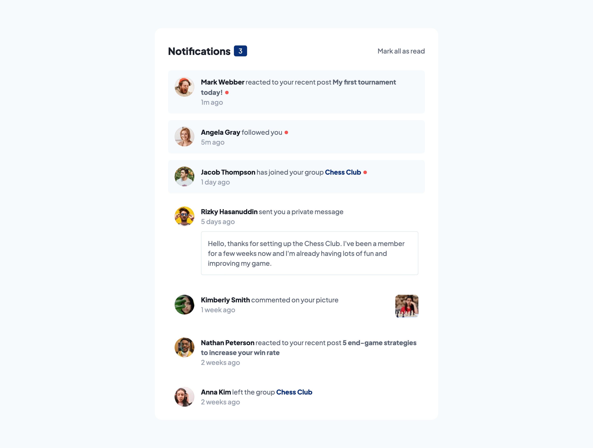
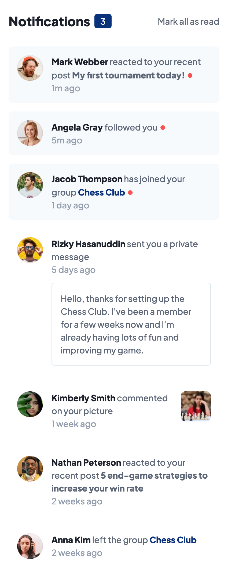

# Frontend Mentor - notifications-page

I coded this notifications-page myself and the style of the page is designed by Fronted Mentor. Fronted Mentor provides challenges for fronted developers so they can make projects without the problem of designing the project. [See the challenge on Frontend Mentor.](https://www.frontendmentor.io/challenges/notifications-page-DqK5QAmKbC)

## The challenge

The challenge was to make a notifications-page with the functionality to mark your notifications as read by clicking on the text 'mark all as read' or to click on a specific notification. For the challenge they provided a style-guide with the font and colors, the images, and screenshots in jpg format how the page should look.

## Screenshots

## My experience

This challenge I learned more about how to reuse span elements, how to set event listeners on multiple elements at with the same function. I never thought that I could check in javascript if an element has a className. That made writing the code for this project a lot easier.

### Links

- Solution URL: [github repository](https://github.com/Jolijn0101/notifications-page)
- Live Site URL: [github page](https://jolijn0101.github.io/notifications-page/)
